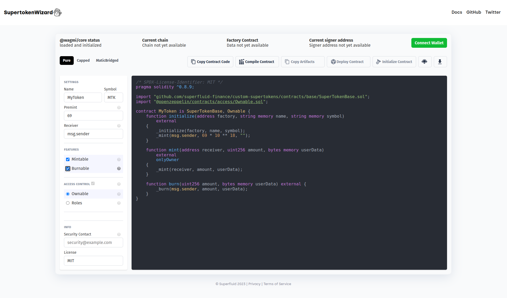

# [Supertoken Contracts Wizard](https://supertoken-wizard.huntersworkshop.xyz)

Contracts Wizard is a web application to interactively build a contract out of components from Superfluid's Supertoken Smart Contracts. Select the kind of contract that you want, set your parameters and desired features, and the Wizard will generate all of the code necessary. The resulting code is ready to be compiled and deployed, or it can serve as a starting point and customized further with application specific logic.

From the app you can copy the raw code, compile it & copy the artefacts and even deploy it to a a range of blockchain networks.

[](https://supertoken-wizard.huntersworkshop.xyz)

## Development

Install dependencies with `yarn install`.

`packages/core` contains the code generation logic for Solidity.

`packages/ui` is the interface built in Svelte. From the root of the monorepo, `yarn workspace @superfluid-wizard/ui run dev` spins up a local server to develop the UI.

TODO: It would be good to see the [backend server](https://github.com/hunters-workshop/solidity-compiler-express-server) getting added to this repo rather than being separate

## Embedding

To embed Contracts Wizard on your site, first include the script tag:

```html
<script async src="https://supertoken-wizard.huntersworkshop.xyz/build/embed.js"></script>
```

Then place `<oz-wizard></oz-wizard>` in the body where you want Contracts Wizard to load.

Optionally focus on specific tab with the `data-tab` attribute as in `<oz-wizard data-tab="PURE"></oz-wizard>`.

## Supported Networks

```ts
enum NetworkId {
  Mainnet = 1,
  GnosisChain = 100,
  Polygon = 137,
  Optimism = 10,
  Arbitrum = 42161,
  Avalanche = 43114,
  BinanceSmartChain = 56,
  Celo = 42220,
}
```

## API

The following describes how to use the Contracts Wizard programmatic API in your own applications.

- [Contracts Wizard API for Solidity](packages/core/README.md)
